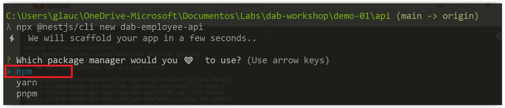

# Criando o Back-End com NestJs

Nessa sessão, vamos criar o back-end da nossa aplicação utilizando o NestJs. Mas, por que o NestJs? Pois para criar uma API com esse framework é muito simples e direto. Assim que, em pouco tempo teremos uma aplicação no server-side pronta!

Se vocês desejarem saber mais detalhes sobre o NestJs pode clicar **[AQUI](https://nestjs.com/)**.

## Criando o Projeto

Primeira coisa que precisamos fazer é criar o projeto com o NestJs. Para isso, crie uma pasta localmente em sua máquina chamada, por exemplo: `dab-project` e dentro dessa pasta, pedirei para você criar a pasta `client`.

E a pasta `api` criaremos usando o seguinte comando do NestJs:


```bash
npx @nestjs/cli new api
```

Aparecerá três opções de package manager que você pode usar no projeto. No nosso caso, estaremos optando por `npm`




