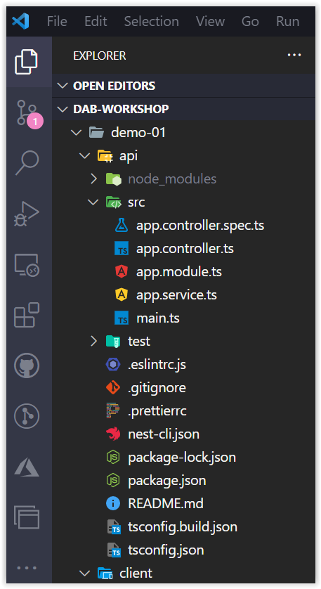

# Criando o Back-End com NestJs

Nessa sessão, vamos criar o back-end da nossa aplicação utilizando o NestJs. Mas, por que o NestJs? Pois para criar uma API com esse framework é muito simples e direto. Assim que, em pouco tempo teremos uma aplicação no server-side pronta!

Se vocês desejarem saber mais detalhes sobre o NestJs pode clicar **[AQUI](https://nestjs.com/)**.

## Criando o Projeto

Primeira coisa que precisamos fazer é criar o projeto com o NestJs. Para isso, crie uma pasta localmente em sua máquina chamada, por exemplo: `dab-project` e dentro dessa pasta, pedirei para você criar outras duas pastas: `api` e `client`.

Após iremos inicialmente focar na pasta `api`. Para criar o projeto, abra o terminal e navegue até a pasta `api` e execute o comando no prompt de comando:

```bash
npx @nestjs/cli new dab-employee-api
```

Aparecerá três opções de package manager que você pode usar no projeto. No nosso caso, estaremos optando por `npm`


Depois de finalizar a criação do projeto, há alguns arquivo que não iremos usar. Com isso, podem deletar os arquivos: 

* `src/app.service.ts`
* `src/app.controller.spec.ts`
* `src/app.controller.ts`
* E a pasta `test`

Em caso de dúvidas, segue a imagem abaixo:




